# Game Streaming (quasar-game-streaming-ts)

A website application use for game live streaming and chatting

## Install the dependencies
```bash
yarn
# or
npm install
```

### Start the app in development mode (hot-code reloading, error reporting, etc.)
```bash
quasar dev
```


### Lint the files
```bash
yarn lint
# or
npm run lint
```


### Format the files
```bash
yarn format
# or
npm run format
```


### Build the app for production
```bash
quasar build
```

### Customize the configuration
See [Configuring quasar.config.js](https://v2.quasar.dev/quasar-cli-vite/quasar-config-js).

### Final product screenshot

-	Home
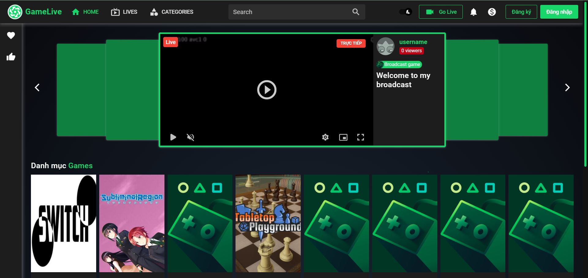

-	Login
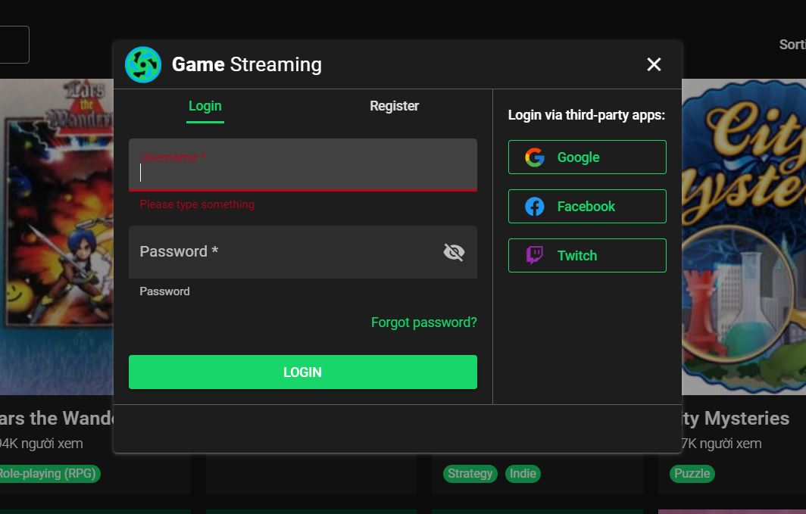

-	Register
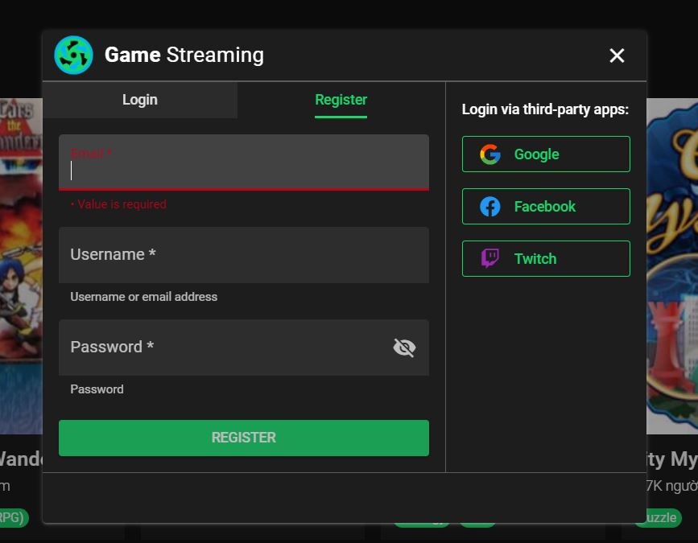

-	List game
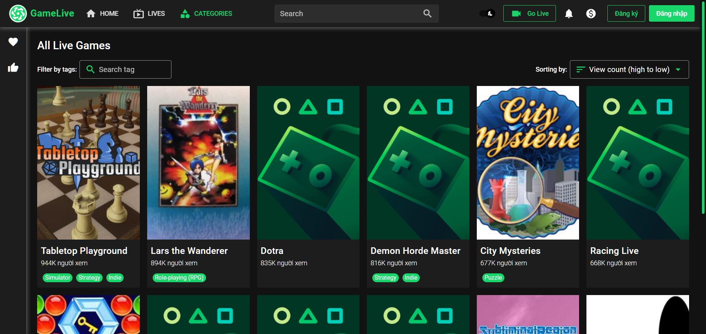

-	Live room
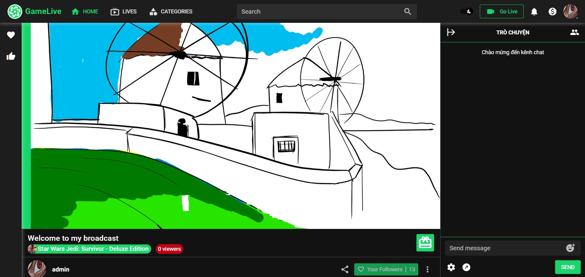

-	Channel info
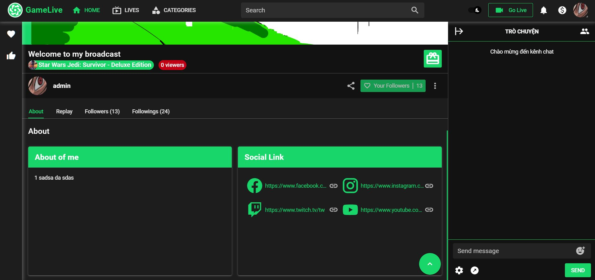

-	Broadcast setting
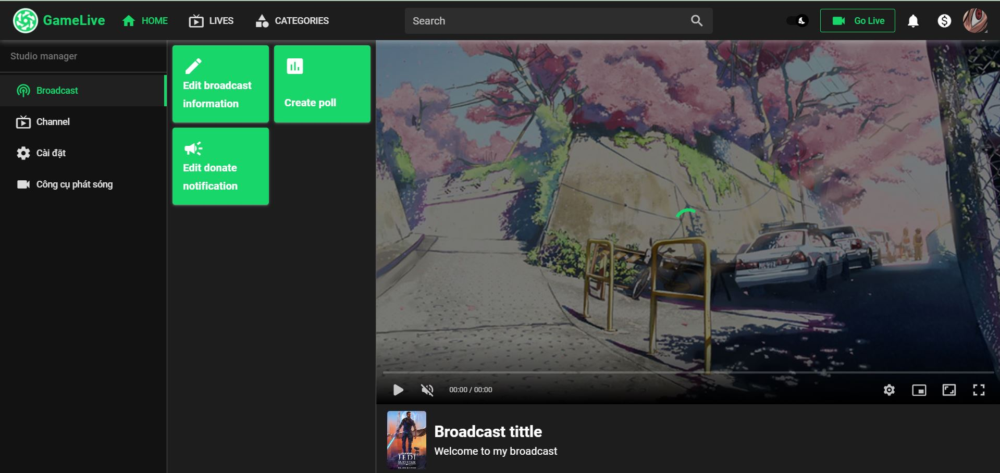

-	Profile info
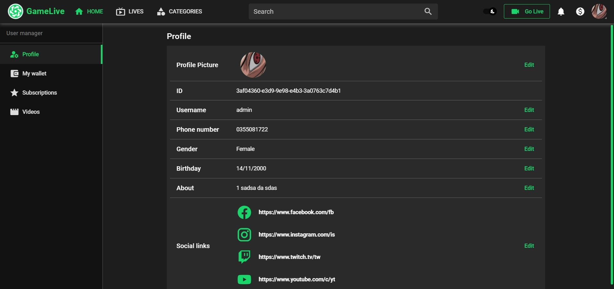

-	List follow
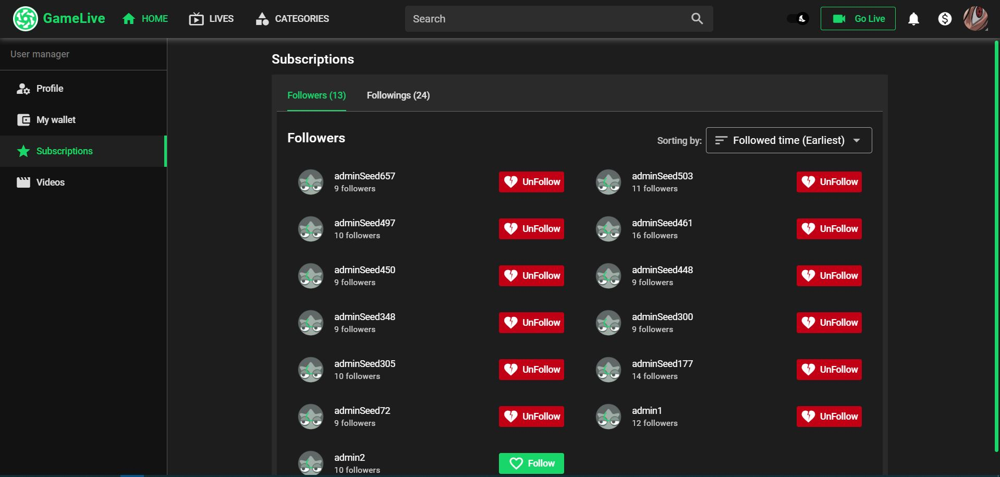

-	List gift
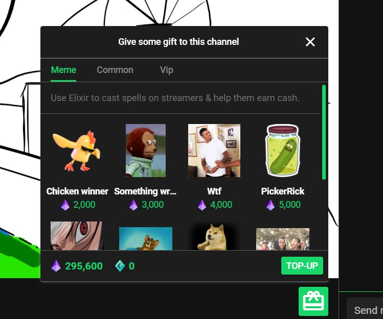

-	Wallet
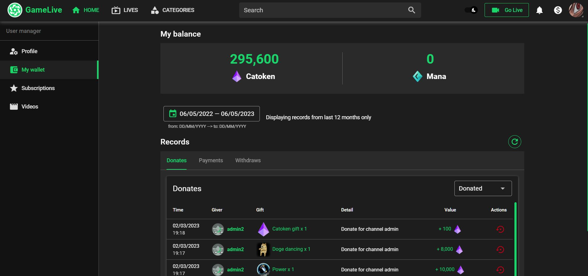

-	Top-up
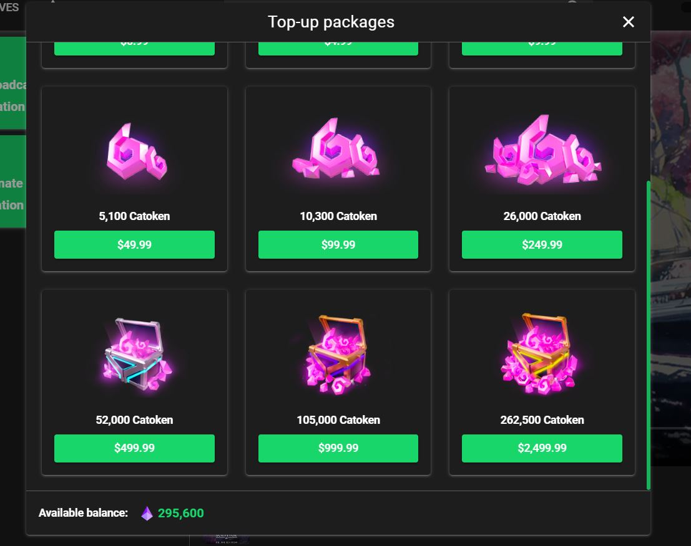

-	Xsolla payment gateway
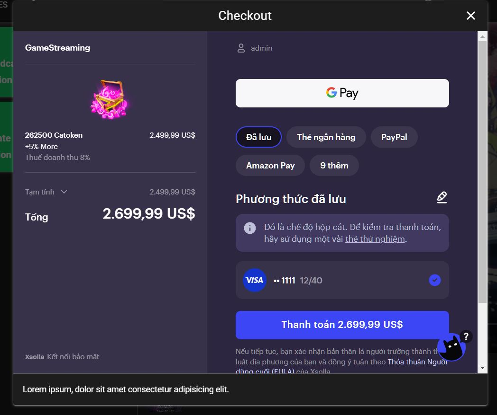


